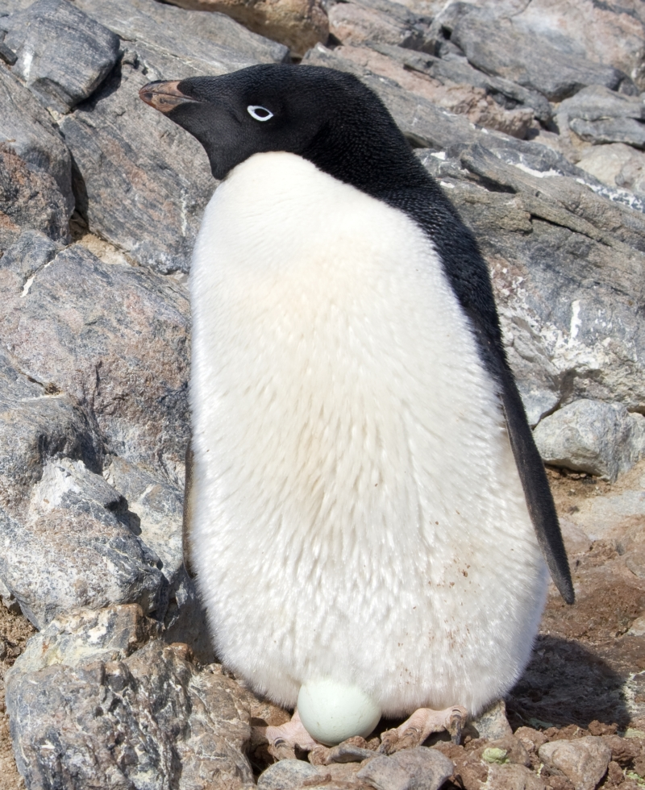
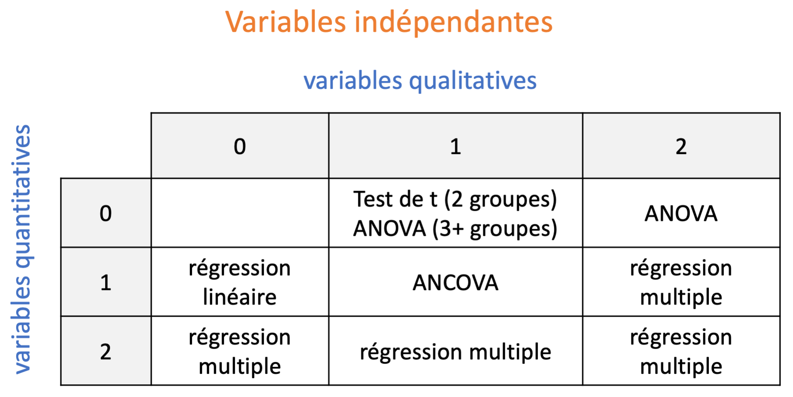
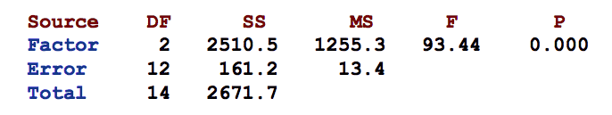
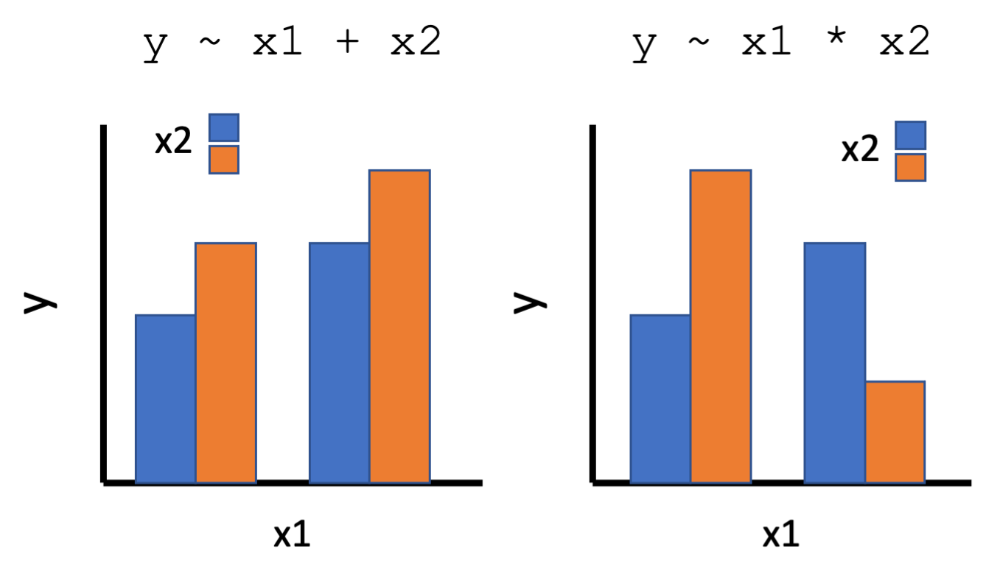
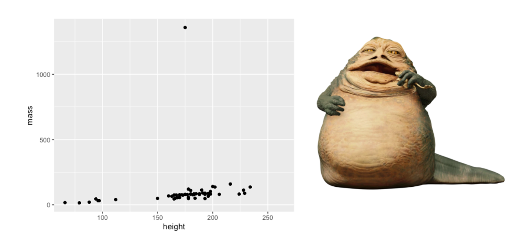
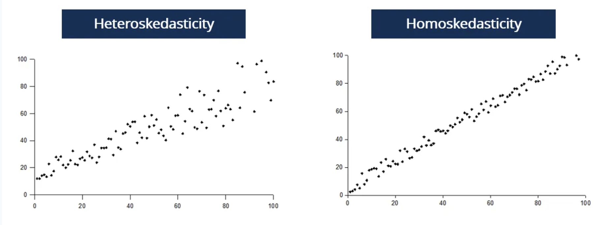
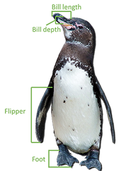
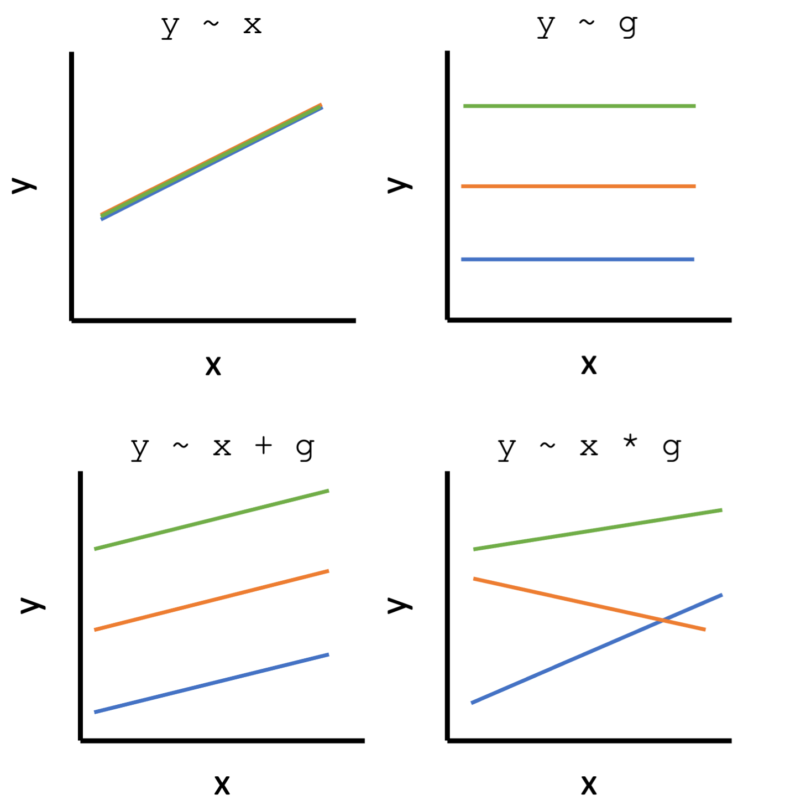

```{r setup, include=FALSE}
knitr::opts_chunk$set(echo = T, warning=F, error=F, message=F)
```

## Bonjour!

- Vincent Fugère (il/lui)
- prof. en sciences de l'environnement à l'UQTR
- [recherche en écologie des eaux douces](https://vfugere.weebly.com/) au [RIVE](https://oraprdnt.uqtr.uquebec.ca/pls/public/gscw031?owa_no_site=2137)
- science des données & environnement

{width=100%}

## Aujourd'hui

- Analyses statistiques de base avec R
- Un peu de révision au passage: `dplyr`, `ggplot2`
- Très peu de théorie! On assume que vous avez fait un cours universitaire de 1er cycle en statistiques et que vous êtes familier.e avec les termes "test de student", "ANOVA", "régression"...
- Masteriser la fonction `lm()`
- Code disponible ici: 
- Défis!

<center> 

{width=25%}

</center>

## Données pour l'atelier

Nous allons réutiliser les ensembles de données que vous avez utilisé lors de deux atelier précédents: gapminder, palmer pinguins, starwars. Nous devons également charger les librairies `dplyr` et `ggplot2`.

```{r, results = 'hide', message=F}
library(dplyr)
library(ggplot2)
library(palmerpenguins)
library(gapminder)
data("starwars")
data("penguins")
data("gapminder")
# #au besoin
# install.packages(c("penguins","gapminder"))
```

## Types de variables

- Selon [StatCan](https://www150.statcan.gc.ca/n1/edu/power-pouvoir/ch8/5214817-fra.htm)
- variables catégoriques/qualitatives: nominales & ordinales
- variables numériques/quantitatives: continues & discrètes

```{r}
head(penguins)
```

## Défi!

Identifiez les variables qualitatives et quantitatives de l'ensemble de données `starwars`

## Défi!

Identifiez les variables qualitatives et quantitatives de l'ensemble de données `starwars`

```{r, results='hide'}
head(starwars)
```
```{r}
glimpse(starwars)
```

## Le modèle linéaire général

- Une seule variable dépendante (réponse) **quantitative**
- Distribution normale (plus ou moins)

$$
y = mx + b
$$
$$
y_i = \beta_0 + \beta_1x_{i1} + \beta_2x_{i2} + ... + \beta_px_{ip} + \epsilon_i
$$
$$
\epsilon \sim N(0,\sigma^2)
$$

## Le modèle linéaire général

- Une seule variable dépendante (réponse) **quantitative**
- Distribution normale (plus ou moins)

```{r}
hist(rnorm(10000))
```

## Le modèle linéaire général

{width=100%, fig.align=center}

## Test de Student (test de t)

- Différence entre deux moyennes
- Chez le manchot Adélie, est-ce que la masse corporelle diffère entre les mâles et les femelles?

```{r}
penguins %>%
  filter(species == 'Adelie') %>% 
  group_by(sex) %>% 
  summarize(masse.moy = mean(body_mass_g))
```

## Test de Student (test de t)
```{r}
penguins %>%
  filter(species == 'Adelie', sex != 'NA') %>%
  ggplot(aes(x=body_mass_g, colour=sex)) + geom_density()
```

## Test de Student (test de t)

Il semble y avoir une différence de masse entre les sexes. La fonction `t.test` nous permet de valider cette hypothèse.

```{r}
adelie <- penguins %>%
  filter(species == 'Adelie', sex != 'NA')
t.test(body_mass_g ~ sex, data = adelie)
```

## Test de Student (test de t)

Il semble y avoir une différence de masse entre les sexes. La fonction `t.test` nous permet de valider cette hypothèse.

```{r}
adelie <- penguins %>%
  filter(species == 'Adelie', sex != 'NA')
t.test(body_mass_g ~ sex, data = adelie)
format(2.2e-16, scientific = F)
```

## Test de Student (test de t)

La fonction `lm` fonctionne pour **tous les types de modèles linéaires** (incluant le test de t).

```{r}
modele <- lm(body_mass_g ~ sex, data = adelie)
summary(modele)
```
## Test de Student (test de t)

$$
Y_i = \beta_0 + \beta_1x_{i} + \epsilon_i
$$
Quelles valeurs la variable "x" (sex) peut-elle prendre?

```{r}
summary(modele)
```

## Défi!

Dans les données `starwars`, est-ce que les personnages provenant de Tatooine sont plus grands que ceux provenant de Naboo? On peut extraire les données pertinentes comme suit:
```{r, fig.height=3, fig.width=3}
nab_tat <- starwars %>% filter(homeworld %in% c('Naboo','Tatooine'))
ggplot(aes(x=homeworld,y=height),data=nab_tat) + geom_boxplot()
```

## Défi!

Dans les données `starwars`, est-ce que les personnages provenant de Tatooine sont plus grands que ceux provenant de Naboo?
```{r}
t.test(height ~ homeworld, data = nab_tat)
```

## Défi!

Dans les données `starwars`, est-ce que les personnages provenant de Tatooine sont plus grands que ceux provenant de Naboo?
```{r}
modele <- lm(height ~ homeworld, data = nab_tat)
summary(modele)
```

## ANOVA

Lorsque notre variable qualitative indépendante comprend plus de deux niveaux, nous pouvons utiliser une analyse de variance (ANOVA) plutôt qu'un test de t. On ajuste le modèle de la même façon avec la fonction `lm`:

```{r}
modele <- lm(body_mass_g ~ species, data = penguins)
summary(modele)
```

## ANOVA

Les coefficients (béta) du modèle indiquent la différence de masse entre chaque niveau et le **niveau de référence**. Par défaut, le niveau de référence d'un facteur est celui qui arrive en première position lorsqu'on classe les niveaux en ordre alphabétique. Pour nos manchots, il y a trois espèces: Adelie, Chinstrap, Gentoo. Adelie est donc le niveau de référence.

```{r}
levels(penguins$species)
```
```{r}
coef(modele)
```
masse moyenne Adelie = 3700, Chinstrap = 3700+32, Gentoo = 3700+1375

## ANOVA

masse moyenne Adelie = 3700, Chinstrap = 3700+32, Gentoo = 3700+1375
```{r, fig.height=4, fig.width=5, fig.align='center'}
ggplot(aes(x=species,y=body_mass_g),data=penguins) + geom_boxplot()
```

## ANOVA

Souvent, pour une ANOVA, on cherche plutôt à tester si la variable indépendante influence au moins un des niveaux, peu importe lequel, et sans nécessairement comparer les niveaux à un niveau de référence. On veut un **tableau d'ANOVA** qui ressemble à cela:

{width=80%}
*https://online.stat.psu.edu/stat415/lesson/13/13.2*

## ANOVA

Il suffit d'utiliser la fonction `anova` pour obtenir le tableau d'ANOVA de notre modèle:

```{r}
anova(modele)
```

## ANOVA

On complémente souvent le test de F de l'ANOVA avec des comparaisons par paires, pour déterminer quels groupes diffèrent les uns des autres. Dans ce cas, y a-t-il une différence entre Chinstrap et Adelie?

```{r, fig.height=4, fig.width=5, fig.align='center'}
ggplot(aes(x=species,y=body_mass_g),data=penguins) + geom_boxplot()
```

## ANOVA

Comparaisons par paires à l'aide de tests de Tukey ("Tukey's Honest Significant Difference"):

```{r}
TukeyHSD(aov(modele))
```
## Défi!

À votre tour! Utilisez les données `gapminder` pour ajuster un modèle d'ANOVA. En 2007, y avait-il une différence **d'espérance de vie** (`lifeExp`) entre les **continents** (`continent`)? Le cas échéant, quelle(s) paire(s) de continents montraient une différence pour cette variable?

```{r, fig.width=5, fig.height=3.5}
donnees_2007 <- gapminder %>% filter(year == 2007)
ggplot(aes(x=continent,y=lifeExp),data=donnees_2007) + geom_boxplot()
```

## Défi!

À votre tour! Utilisez les données `gapminder` pour ajuster un modèle d'ANOVA. En 2007, y avait-il une différence **d'espérance de vie** (`lifeExp`) entre les **continents** (`continent`)? Le cas échéant, quelle(s) paire(s) de continents montraient une différence pour cette variable?

```{r}
modele <- lm(lifeExp ~ continent, donnees_2007)
anova(modele)
```

## Défi!

À votre tour! Utilisez les données `gapminder` pour ajuster un modèle d'ANOVA. En 2007, y avait-il une différence **d'espérance de vie** (`lifeExp`) entre les **continents** (`continent`)? Le cas échéant, quelle(s) paire(s) de continents montraient une différence pour cette variable?

```{r}
TukeyHSD(aov(modele))
```

## Défi!

Merveilleux, mais... en regardant ces boîtes à moustaches (*boxplot*), trouvez-vous qu'il y a quelque chose de louche?

```{r, fig.width=5, fig.height=3.5}
ggplot(aes(x=continent,y=lifeExp),data=donnees_2007) + geom_boxplot()
```

## Suppositions des modèles linéaires

$$
Y_i = \beta_0 + \beta_1x_{i} + \epsilon_i
$$

$$
\epsilon \sim N(0,\sigma^2)
$$

Quelques suppositions des modèles linéaires:

- Les points de données sont indépendants (p. ex., on ne mesure pas le même manchot ou le même pays 10 fois!)
- Les **résidus** du modèle suivent une distribution normale
- La variance des résidus est identique pour tous les groupes (homoscédasticité)

```{r, fig.width=3, fig.height=2.5, echo=FALSE}
ggplot(aes(x=continent,y=lifeExp),data=donnees_2007) + geom_boxplot()
```

## Suppositions des modèles linéaires

Nous pouvons vérifier ces suppositions à l'aide de tests.
**IMPORTANT**: pour ces deux tests, nous voulons que p > 0.05!

```{r}
#1. normalité des résidus
mod.resid <- resid(modele)  # Sortir les résidus
shapiro.test(mod.resid)  # Test de Shapiro-Wilk: p < 0.05 = MAUVAIS!
```

## Suppositions des modèles linéaires

Nous pouvons vérifier ces suppositions à l'aide de tests.
**IMPORTANT**: pour ces deux tests, nous voulons que p > 0.05!

```{r}
#1. normalité des résidus
mod.resid <- resid(modele)  # Sortir les résidus
shapiro.test(mod.resid)  # Test de Shapiro-Wilk: p < 0.05 = MAUVAIS!

# 2. homoscédasticité
bartlett.test(lifeExp ~ continent, donnees_2007) # Test de Bartlett: p < 0.05 = MAUVAIS!
```

## Suppositions des modèles linéaires

**Il faut vérifier les suppositions d'un modèle avant de l'interpréter!** S'il y a un problème, on ne regarde même pas les résultats.

Solutions potentielles:

- exclure le(s) groupe(s) particulièrement problématique(s), ce qui diminue la portée de l'analyse
- transformer la variable réponse (p.ex. log)
- changer la structure du modèle en ajoutant des variables indépendantes
- utiliser un modèle linéaire généralisé ou d'autres outils statistiques plus avancés

## ANOVA avec deux facteurs

Une ANOVA peut inclure plus d'une variables qualitatives, ce qui permet notamment de quantifier les intéractions entre deux ou plusieurs variables. Par exemple, est-ce que l'effet du sexe sur la masse des manchots dépend de l'espèce?

```{r, fig.height=3.5, fig.width=6}
penguins <- tidyr::drop_na(penguins)
ggplot(aes(x=species,y=body_mass_g,fill=sex),data=penguins) + geom_boxplot()
```

## ANOVA avec deux facteurs

Une ANOVA peut inclure plus d'une variables qualitatives, ce qui permet notamment de quantifier les intéractions entre deux ou plusieurs variables. Par exemple, est-ce que l'effet du sexe sur la masse des manchots dépend de l'espèce?

```{r}
modele <- lm(body_mass_g ~ species + sex, data = penguins)
anova(modele)
```

Que manque-t-il?

## ANOVA avec deux facteurs

{width=60%}

```{r}
modele <- lm(body_mass_g ~ species * sex, data = penguins)
anova(modele)
```

## ANOVA avec deux facteurs
N'oublions pas qu'il s'agit encore du modèle linéaire général:

$$
Y_i = \beta_0 + \beta_1x_{i1} + \beta_2x_{i2} + ... + \beta_px_{ip} + \epsilon_i
$$

```{r}
summary(modele)
```

## Régression & ANCOVA

{width=100%, fig.align=center}

## Régression simple

Chez les personnages de star wars, y a-t-il une relation entre la masse corporelle et la grandeur?

```{r, eval=F}
ggplot(aes(x=height,y=mass),data=starwars) + geom_point()
```

## Régression simple

Chez les personnages de star wars, y a-t-il une relation entre la masse corporelle et la grandeur?

```{r, eval=F}
ggplot(aes(x=height,y=mass),data=starwars) + geom_point()
```
{width=100%}

## Régression simple

Chez les personnages de star wars (autres que Jabba the Hut), y a-t-il une relation entre la masse corporelle et la grandeur?

```{r, fig.width=4.5, fig.height=3.5}
sw <- starwars %>% filter(mass < 1000)
ggplot(aes(x=height,y=mass),data=sw) + geom_point()
```

## Régression simple

Chez les personnages de star wars (autres que Jabba the Hut), y a-t-il une relation entre la masse corporelle et la grandeur?

```{r}
modele <- lm(mass ~ height, data = sw)
summary(modele)
```

## Régression simple

Validons les suppositions. Premièrement, la normalité des résidus:

```{r}
mod.resid <- resid(modele)
shapiro.test(mod.resid)  # Test de Shapiro-Wilk: p < 0.05 = MAUVAIS!
```

Ça ne passe pas...

## Régression simple

On ré-essaie en transformant notre variable **dépendante**.

```{r}
sw$log_masse <- log10(sw$mass)
modele <- lm(log_masse ~ height, data = sw)
mod.resid <- resid(modele)
shapiro.test(mod.resid) #yé!
```
{width=20%, align=right}

## Régression simple

Pour l'homogénéité de la variance, il suffit de regarder la distribution des résidus en fonction des valeurs de y estimées par le modèle.


{width=100%}


Graphique tiré de ce [site web](https://corporatefinanceinstitute.com/resources/knowledge/other/heteroskedasticity/)

## Régression simple

Pour l'homogénéité de la variance, il suffit de regarder la distribution des résidus en fonction des valeurs de y estimées par le modèle. Ici, on espère observer un nuage de point sans aucune forme triangulaire ou tendance directionnelle évidente.
```{r, fig.width=5,fig.height=4}
plot(modele, which = 1)
```

## Régression simple

Tout est bien. On peut interpréter le modèle...

```{r}
summary(modele)
```

## Régression simple

Tout est bien. On peut interpréter le modèle et le visualiser.

```{r, fig.width=5,fig.height=4}
ggplot(aes(x=height,y=log_masse),data=sw) +
  geom_point() + 
  geom_smooth(method='lm')
```

## Régression simple

$$
y_i = \beta_0 + \beta_1x_{i} + \epsilon_i
$$

Plutôt que d'utiliser ggplot pour ajuster le modèle à nouveau, nous pouvons aussi extraire les coéfficients (béta) de notre modèle et les utiliser pour "dessiner" la droite.

```{r}
coef(modele)
b0 <-  coef(modele)[1]
b1 <-  coef(modele)[2]
c(b0,b1)
```

Quelle est l'équation de notre modèle linéaire?

## Régression simple

$$
y_i = 0.9912 + 0.0049 * height_i + \epsilon_i
$$

```{r, fig.width=5,fig.height=4}
ggplot(aes(x=height,y=log_masse),data=sw) +
  geom_point() + 
  geom_abline(intercept = b0, slope = b1)
```

## Défi!

À votre tour! Dans les données `penguins`, y a-t-il une relation entre la longueur du bec (`bill_length_mm`) et la longueur des nageoires (`flipper_length_mm`)?

{width=40%}

## Défi!

```{r}
modele <- lm(bill_length_mm ~ flipper_length_mm, penguins)
par(mfrow=c(1,2))
plot(modele, which = 1:2)
```

## Défi!

```{r}
summary(modele)
```

longueur du bec = -7.21856 + 0.25482 * longueur de la nageoire

## Défi!

```{r}
ggplot(aes(x=flipper_length_mm,y=bill_length_mm),data=penguins) +
  geom_point() + 
  geom_smooth(method='lm')
```

## ANCOVA

Analyse de covariance: 1 variable qualitative, 1 variable quantitative.

```{r, fig.width=6,fig.height=4}
ggplot(aes( x=body_mass_g, y=bill_length_mm, colour = species), data = penguins) +
  geom_point() + geom_smooth(method = "lm", aes(fill = species))
```

## ANCOVA

{width=60%}

## ANCOVA

```{r}
modele.sans.interaction <- lm(bill_length_mm ~ body_mass_g + species, data = penguins)
summary(modele.sans.interaction) #equation pour le manchot Gentoo?
```

## ANCOVA

```{r}
modele.avec.interaction <- lm(bill_length_mm ~ body_mass_g * species, data = penguins)
summary(modele.avec.interaction) #equation pour le manchot Gentoo?
```

## Régression multiple

{width=100%, fig.align=center}

## Régression multiple

En ajoutant une troisième variable à notre modèle, on arrive à un modèle de régression multiple. **Attention: les variables indépendantes ne doivent pas être trop corrélées les unes aux autres** (problème de la *multicolinéarité*).

```{r}
modele <- lm(bill_length_mm ~ body_mass_g + species + year, data = penguins)
summary(modele)
```

## Régression multiple

On valide le modèle de la même façon.

```{r, fig.width = 7, fig.height=3.5}
par(mfrow=c(1,2))
plot(modele, which = 1:2)
```

## Régression multiple

La représentation graphique d'un modèle de régression multiple est plus difficile. Souvent, nous nous contentons de montrer les coefficients du modèle sur un *forest plot*.

```{r, fig.width = 5, fig.height=3}
sjPlot::plot_model(modele)
```

## Régression multiple

La représentation graphique d'un modèle de régression multiple est plus difficile. Souvent, nous nous contentons de montrer les coefficients du modèle sur un *forest plot*. Pour pouvoir comparer la **taille des effets**, il faut centrer-réduire toutes les variables quantitatives:

```{r, fig.width = 5, fig.height=3}
modele <- lm(bill_length_mm ~ scale(body_mass_g) + species + scale(year), data = penguins)
sjPlot::plot_model(modele)
```

## Au delà du modéle linéaire général

- La variable réponse ne suit pas une distribution normale: modèles linéaire généralisés
- Les points de données ne sont pas indépendants: modèles mixtes
- La relation entre x et y n'est pas linéaire: modèles additifs (GAM)
- Plusieurs variables **dépendantes**: analyse multidimensionnelle

Quelques ressources utiles:

- [Ateliers R du CSBQ](https://r.qcbs.ca/)
- [Numerilab de l'UQTR](https://rive-numeri-lab.github.io/)
- [Our coding club](https://ourcodingclub.github.io/)